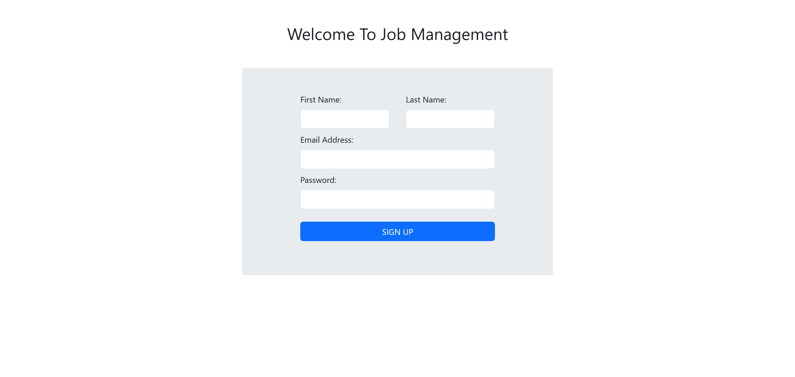
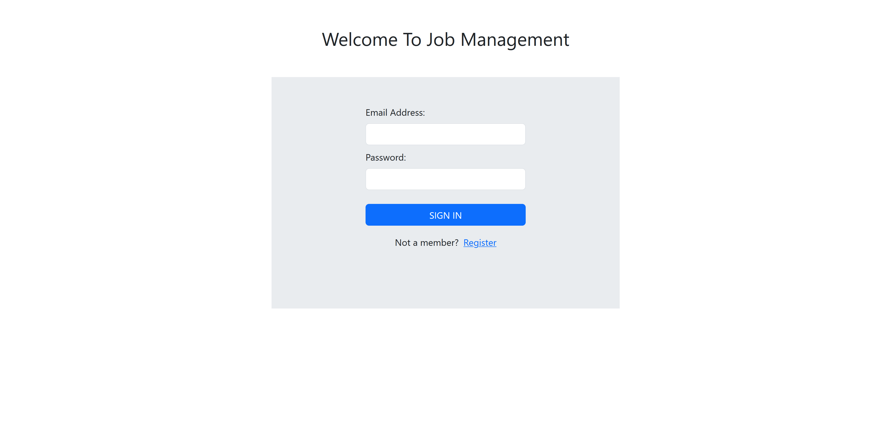
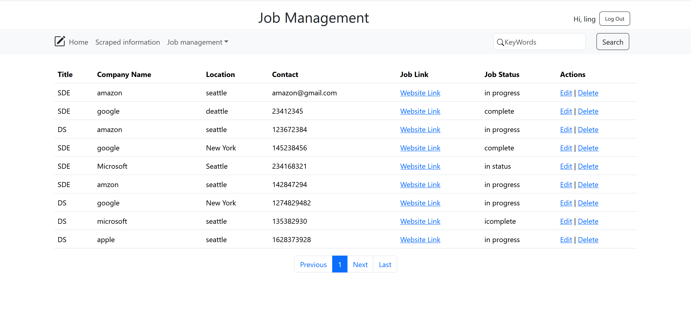
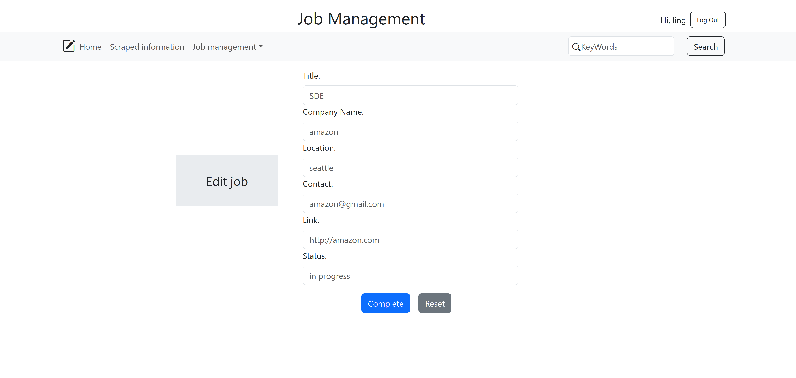
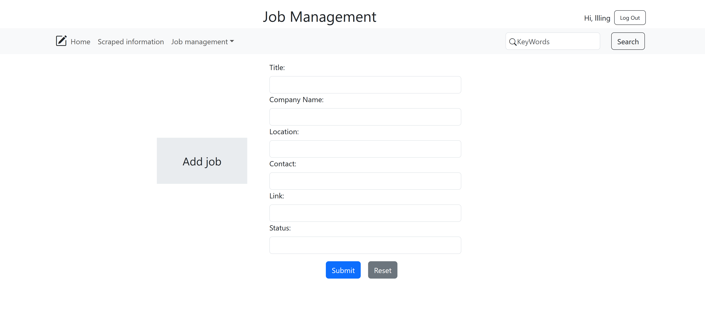
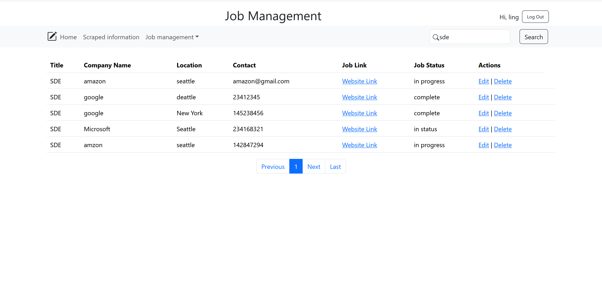

# Job Applications Management Website

This is a web application built using Flask, HTML, CSS, and Bootstrap to help users manage their job applications. The website allows users to register, log in, and perform CRUD operations (Create, Read, Update, Delete) on job applications. Users can also search for specific job applications by keywords.

## Features

- **User Registration**: Users can sign up for an account.

- **User Login**: Registered users can log in to access their dashboard.

- **Manage Job Applications**: Users can create, read, update, and delete job applications.  
*View*  

*Edit*

*Add*

- **Search Functionality**: Users can search for job applications by title, company, or keyword.

## Technologies Used

- **Backend**: Flask (Python)
- **Frontend**: HTML, CSS, Bootstrap
- **Database**: MySQL

### Project starts
    python app.py
